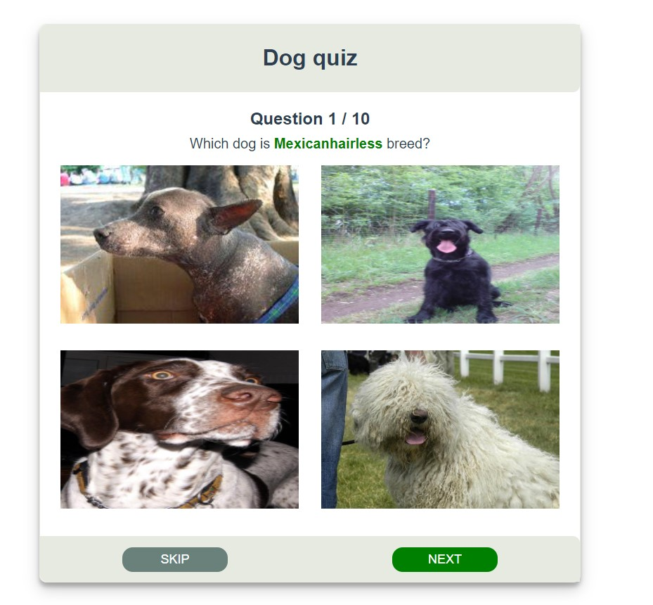

# dogs-app

### Short Description

I created a Dog Quiz App. There are 10 questions with only one correct answer. I fetch a breed API call to generate random pictures "forEach" dog breed. 



## Before starting the project

```
cd quiz_app
```

## Project setup

```
yarn
```

### Start project

```
yarn serve 
```

### Lints and fixes files

```
yarn lint
```
